# Huntress Bot Plugins Documentation

Complete list of all plugins in the Huntress repository with descriptions and dependency information.

## Plugin List (48 Total)

### Core/Utility Plugins

#### Management
**File**: `Management.php` (original), `management.py` (Artemis port)  
**Description**: Core bot management commands. Provides `!ping`, `!artemis` (bot info), `!restart`, `!update` (git pull), and `!invite` commands. Shows bot statistics, memory usage, uptime, loaded plugins, dependencies, and emoji-based version hashes.  
**Dependencies**: None  
**Commands**: `!ping`, `!artemis`, `!restart`, `!update`, `!invite`

#### PermissionFrontend
**File**: `PermissionFrontend.php`  
**Description**: Frontend for managing permissions via commands. Provides `!permission`, `!perm`, `!hpm` commands to check, add, and manage permissions. Uses GetOpt for command parsing.  
**Dependencies**: None (but manages permissions for other plugins)  
**Commands**: `!permission`, `!perm`, `!hpm`

#### Evaluate
**File**: `Evaluate.php`  
**Description**: Allows execution of arbitrary PHP code (admin only). Dangerous but useful for debugging and testing.  
**Dependencies**: None  
**Commands**: `!eval`  
**Security**: Restricted to `evalUsers` in config

#### ServerActivity
**File**: `ServerActivity.php`  
**Description**: Tracks message statistics per guild using RRDtool. Generates activity graphs showing message rates over time.  
**Dependencies**: None  
**Commands**: `!messagestats`  
**External**: Requires RRDtool

---

### Card & Dice Games

#### CardsNormal
**File**: `CardsNormal.php`  
**Description**: Standard playing card deck system. Allows drawing cards from a shuffled deck per channel.  
**Dependencies**: None  
**Commands**: `!card`

#### CardsTarot
**File**: `CardsTarot.php`  
**Description**: Tarot card deck system. Extends CardsNormal with tarot-specific cards (Major and Minor Arcana).  
**Dependencies**: **CardsNormal** (extends)  
**Commands**: `!tarot`

#### Roll
**File**: `Roll.php`  
**Description**: Dice rolling system. Parses dice notation (e.g., `!roll 2d6+3`) and rolls dice. Checks for other dice bots to avoid conflicts.  
**Dependencies**: None  
**Commands**: `!roll`, `!r`

#### GenesysDice
**File**: `GenesysDice.php`  
**Description**: Specialized dice system for Genesys RPG (Star Wars RPG). Uses custom dice with success/failure, advantage/threat, triumph/despair symbols.  
**Dependencies**: None  
**Commands**: `!genesys`

---

### User & Role Management

#### User
**File**: `User.php`  
**Description**: User information and utilities. Provides `!user` for user info, `!roster` to list members with a role, and `!av` for avatars.  
**Dependencies**: None  
**Commands**: `!user`, `!roster`, `!av`

#### Role
**File**: `Role.php`  
**Description**: Role self-management system. Allows users to toggle roles, bind roles to commands, and set up role inheritance (where having one role automatically grants another).  
**Dependencies**: None  
**Commands**: `!role`, `!roles`, `!bindrole`, `!inheritrole`

#### ReactRole
**File**: `ReactRole.php`  
**Description**: Reaction-based role assignment. Users react to messages to get roles. Other plugins can register reactable messages via `ReactRole::addReactableMessage()`.  
**Dependencies**: None (but used by other plugins)  
**Commands**: None (reaction-based)

#### GuildMemberPuller
**File**: `GuildMemberPuller.php`  
**Description**: Fetches all guild members to populate the member cache. Useful for ensuring all members are loaded.  
**Dependencies**: None  
**Commands**: None (automatic)

---

### Event & Calendar

#### Event
**File**: `Event.php`  
**Description**: Event calendar system. Users can create events, view upcoming events, and manage event calendars. Supports timezone-aware scheduling.  
**Dependencies**: **Localization** (uses `Localization::fetchTimezone()`)  
**Commands**: `!event`, `!calendar`, `!setCalendar`

#### Remind
**File**: `Remind.php`  
**Description**: Reminder system. Users can set reminders that trigger at specified times. Reminders are stored in database and checked periodically.  
**Dependencies**: **Localization** (uses `Localization::fetchTimezone()`)  
**Commands**: `!rem`, `!remind`, `!remindme`, `!reminder`

#### Agenda
**File**: `Agenda.php`  
**Description**: Staff motion/voting tally system. Fires `agendaPluginConf` event that other plugins can listen to for configuration. Tabulates votes from message reactions.  
**Dependencies**: None (but fires event used by other plugins)  
**Commands**: `!agenda`

---

### RSS & Content Feed Plugins

#### RCB
**File**: `RCB.php`  
**Description**: Reddit user monitoring plugin. Extends RSSProcessor to monitor specific Reddit users' posts/comments in r/WormFanfic.  
**Dependencies**: **RSSProcessor** (extends)  
**Commands**: None (automatic RSS monitoring)

#### WormMemes
**File**: `WormMemes.php`  
**Description**: Reddit feed for r/WormMemes. Extends RedditProcessor to post memes to different channels based on category (Ward, Pact, Pale, Twig, etc.).  
**Dependencies**: **RedditProcessor** (extends)  
**Commands**: None (automatic RSS monitoring)

#### WormRP
**File**: `WormRP.php`  
**Description**: Worm RP server-specific plugin. Monitors wiki RSS feed and listens to `agendaPluginConf` event to provide voting configuration.  
**Dependencies**: **RSSProcessor** (uses), listens to **Agenda** event  
**Commands**: Various server-specific commands

#### Ironreach
**File**: `Ironreach.php`  
**Description**: Ironreach server-specific plugin. Monitors Twitter feed via RSS, manages jury system, talking stick, voice chat channel naming, and listens to `agendaPluginConf` event.  
**Dependencies**: **RSSProcessor** (uses), listens to **Agenda** event  
**Commands**: `!jury`, `!talkingstick`, `!vc`

#### PCT
**File**: `PCT.php`  
**Description**: PCT (Pale Cup Tournament) server plugin. Uses RedditProcessor to monitor Reddit users for fanfic posts. Also manages rank promotion/demotion system.  
**Dependencies**: **RedditProcessor** (uses)  
**Commands**: `!promote`, `!demote` (automatic RSS monitoring)

---

### Server-Specific Plugins

#### Ascalon
**File**: `Ascalon.php`  
**Description**: Ascalon server plugin. Deletes "permission denied" messages from another bot (Sidekick) to avoid command conflicts.  
**Dependencies**: None  
**Commands**: None (automatic message deletion)

#### BeholdersBasement
**File**: `BeholdersBasement.php`  
**Description**: Beholder's Basement server plugin. Manages game-related features, Shadowrun dice rolling, pride dice server icon rotation, and game addition system.  
**Dependencies**: None  
**Commands**: `!bb`, `!icon`, `!sr`

#### CauldronCup
**File**: `CauldronCup.php`  
**Description**: Cauldron Cup tournament management system. Manages match creation, competitor registration, voting, and deadlines for writing competitions.  
**Dependencies**: None  
**Commands**: `!ccup`, `!ccm`

#### CauldronEmoteHub
**File**: `CauldronEmoteHub.php`  
**Description**: Emote hub management for Cauldron server. Handles emote sharing between servers.  
**Dependencies**: None  
**Commands**: Server-specific

#### CollieTechDev
**File**: `CollieTechDev.php`  
**Description**: CollieTechDev server plugin. Uses ReactRole for role assignment.  
**Dependencies**: **ReactRole** (uses `ReactRole::addReactableMessage()`)  
**Commands**: Server-specific

#### DrownedVale
**File**: `DrownedVale.php`  
**Description**: Drowned Vale server plugin. Manages quests, role assignments, and uses ReactRole.  
**Dependencies**: **ReactRole** (uses `ReactRole::addReactableMessage()`)  
**Commands**: Server-specific

#### FuglyBobs
**File**: `FuglyBobs.php`  
**Description**: Fugly Bob's server plugin. Manages posts and content.  
**Dependencies**: None  
**Commands**: Server-specific

#### Masturbatorium
**File**: `Masturbatorium.php`  
**Description**: Masturbatorium server plugin. Rules-read verification system.  
**Dependencies**: None  
**Commands**: Server-specific

#### Misfit
**File**: `Misfit.php`  
**Description**: Misfit server plugin. Character transformation/rolling system for a specific user. Tracks body part transformations with species and levels.  
**Dependencies**: None  
**Commands**: `!misfit` (user-specific)

#### MisfitDiscord
**File**: `MisfitDiscord.php`  
**Description**: Misfit Discord server-specific features. Manages Twitch/Patreon subscription role syncing and YouTube video feed monitoring via YoutubeProcessor.  
**Dependencies**: **YoutubeProcessor** (uses, not a plugin)  
**Commands**: None (automatic role management and YouTube feeds)

#### Nash40k
**File**: `Nash40k.php`  
**Description**: Nash 40k server plugin. Manages server icon rotation.  
**Dependencies**: None  
**Commands**: Server-specific

#### WormRPFlairs
**File**: `WormRPFlairs.php`  
**Description**: Worm RP flairs system. Manages user reputation/flair system with wiki integration. Edits wiki pages to update character reputation.  
**Dependencies**: None  
**Commands**: `!rep`, `!reputation`

---

### Utility & Fun Plugins

#### Choose
**File**: `Choose.php`  
**Description**: Random choice picker. Picks randomly from comma-separated options.  
**Dependencies**: None  
**Commands**: `!choose`

#### Snowflake
**File**: `Snowflake.php`  
**Description**: Generates Discord snowflake IDs. Useful for testing and development.  
**Dependencies**: None  
**Commands**: `!snowflake`

#### State
**File**: `State.php`  
**Description**: Server state announcements. Allows posting state messages to channels (rules-read verification for Masturbatorium).  
**Dependencies**: None  
**Commands**: `!state`

#### Whoa
**File**: `Whoa.php`  
**Description**: Temporary slowmode management. Sets slowmode that automatically expires after a duration.  
**Dependencies**: None  
**Commands**: `!whoa`, `!slowmode`

#### TelephoneDelay
**File**: `TelephoneDelay.php`  
**Description**: Delayed message forwarding system. Forwards messages from one channel to another with configurable delays.  
**Dependencies**: None  
**Commands**: `!telephone`

#### Archive
**File**: `Archive.php`  
**Description**: Channel archiving tool. Archives entire channels to files (admin only due to resource usage).  
**Dependencies**: None  
**Commands**: `!archive`  
**Security**: Admin only

#### Links
**File**: `Links.php`  
**Description**: Custom link/shortcut management per guild. Store and retrieve custom links.  
**Dependencies**: None  
**Commands**: `!link`, `!links`

#### Shipping
**File**: `Shipping.php`  
**Description**: Ship name management. Add/remove/list ship names per guild.  
**Dependencies**: None  
**Commands**: `!ship`

#### GamesBot
**File**: `GamesBot.php`  
**Description**: Game tagging system. Users can tag themselves with games they play, and others can ping them by game tag.  
**Dependencies**: None  
**Commands**: `!gamesbot`, `!gamebot`, `!gb`

#### MatchVoting
**File**: `MatchVoting.php`  
**Description**: Match voting system. Creates matches with competitors and allows voting. Used for tournaments and competitions.  
**Dependencies**: None  
**Commands**: `!match`, `!tally`

#### MusicBox
**File**: `MusicBox.php`  
**Description**: Music playback via external JavaScript bot bridge. Plays music in voice channels.  
**Dependencies**: None  
**Commands**: `!play`  
**External**: Requires external music bot

#### Observer
**File**: `Observer.php`  
**Description**: Moderation logging and user reporting system. Logs message deletions, member joins/leaves, invites, and handles user reports via reactions.  
**Dependencies**: None  
**Commands**: `!observer`

#### Identity
**File**: `Identity.php`  
**Description**: Bot identity management. Periodically updates bot avatar and status/activity.  
**Dependencies**: None  
**Commands**: None (automatic)

#### Localization
**File**: `Localization.php`  
**Description**: Internationalization and timezone management. Users can set timezones and locales. Provides time conversion utilities.  
**Dependencies**: None (but used by other plugins)  
**Commands**: `!time`, `!timezone`

#### Stonks
**File**: `Stonks.php`  
**Description**: Stock market integration. Fetches stock quotes and information.  
**Dependencies**: None  
**Commands**: `!stonks`  
**External**: Yahoo Finance API

#### IFunny
**File**: `IFunny.php`  
**Description**: iFunny watermark detection. Automatically detects and adds iFunny watermarks to uploaded images (10% chance unless override permission).  
**Dependencies**: None  
**Commands**: None (automatic on image upload)  
**External**: Image processing library

---

## Dependency Graph

```mermaid
graph TD
    %% Base Classes
    RSSProcessor[RSSProcessor<br/>Base RSS Feed Handler]
    RedditProcessor[RedditProcessor<br/>Base Reddit Feed Handler]
    
    %% Core Plugins
    Management[Management]
    PermissionFrontend[PermissionFrontend]
    ServerActivity[ServerActivity]
    Localization[Localization]
    
    %% Card/Dice Plugins
    CardsNormal[CardsNormal]
    CardsTarot[CardsTarot]
    Roll[Roll]
    GenesysDice[GenesysDice]
    
    %% User/Role Plugins
    User[User]
    Role[Role]
    ReactRole[ReactRole]
    GuildMemberPuller[GuildMemberPuller]
    
    %% Event Plugins
    Event[Event]
    Remind[Remind]
    Agenda[Agenda]
    
    %% RSS Feed Plugins
    RCB[RCB]
    WormMemes[WormMemes]
    WormRP[WormRP]
    Ironreach[Ironreach]
    PCT[PCT]
    MisfitDiscord[MisfitDiscord]
    
    %% Server-Specific Plugins
    CollieTechDev[CollieTechDev]
    DrownedVale[DrownedVale]
    
    %% Base Classes
    YoutubeProcessor[YoutubeProcessor<br/>Base YouTube Handler]
    
    %% Dependencies
    CardsTarot --> CardsNormal
    RCB --> RSSProcessor
    WormMemes --> RedditProcessor
    WormRP --> RSSProcessor
    Ironreach --> RSSProcessor
    PCT --> RedditProcessor
    Event --> Localization
    Remind --> Localization
    CollieTechDev --> ReactRole
    DrownedVale --> ReactRole
    MisfitDiscord --> YoutubeProcessor
    WormRP -.->|listens to| Agenda
    Ironreach -.->|listens to| Agenda
    
    %% Styling
    classDef baseClass fill:#e1f5ff,stroke:#01579b
    classDef corePlugin fill:#f3e5f5,stroke:#4a148c
    classDef serverPlugin fill:#fff3e0,stroke:#e65100
    
    class RSSProcessor,RedditProcessor,YoutubeProcessor baseClass
    class Management,PermissionFrontend,ServerActivity,Localization corePlugin
    class CollieTechDev,DrownedVale,WormRP,Ironreach,MisfitDiscord serverPlugin
```

## Dependency Details

### Direct Inheritance
- **CardsTarot** extends **CardsNormal**
- **RCB** extends **RSSProcessor**
- **WormMemes** extends **RedditProcessor**

### Class Usage (Not Inheritance)
- **Event** uses `Localization::fetchTimezone()`
- **Remind** uses `Localization::fetchTimezone()`
- **CollieTechDev** uses `ReactRole::addReactableMessage()`
- **DrownedVale** uses `ReactRole::addReactableMessage()`
- **WormRP** uses `RSSProcessor` class (instantiates)
- **Ironreach** uses `RSSProcessor` class (instantiates)
- **PCT** uses `RedditProcessor` class (instantiates)

### Event Dependencies
- **Agenda** fires `agendaPluginConf` event
- **WormRP** listens to `agendaPluginConf` event
- **Ironreach** listens to `agendaPluginConf` event

### Base Classes (Not Plugins)
- **RSSProcessor**: Base class for RSS feed processing (not a plugin itself)
- **RedditProcessor**: Base class for Reddit feed processing (extends RSSProcessor, not a plugin itself)
- **YoutubeProcessor**: Base class for YouTube feed processing (used by MisfitDiscord, not a plugin itself)

## Plugin Categories

### Core Framework Plugins
- Management
- PermissionFrontend
- ServerActivity
- Evaluate

### User Management
- User
- Role
- ReactRole
- GuildMemberPuller
- Identity

### Content & Entertainment
- CardsNormal, CardsTarot
- Roll, GenesysDice
- Choose
- Snowflake

### Event & Scheduling
- Event
- Remind
- Agenda

### RSS & Feed Monitoring
- RCB
- WormMemes
- WormRP
- Ironreach
- PCT

### Moderation & Logging
- Observer
- Archive
- Whoa
- State

### Server-Specific
- Ascalon
- BeholdersBasement
- CauldronCup
- CauldronEmoteHub
- CollieTechDev
- DrownedVale
- FuglyBobs
- Masturbatorium
- Misfit
- MisfitDiscord
- Nash40k
- WormRPFlairs

### Utility
- Links
- Shipping
- GamesBot
- MatchVoting
- MusicBox
- Localization
- Stonks
- IFunny
- TelephoneDelay

## Notes

- Most plugins are independent and can function standalone
- **Localization** is a utility plugin used by Event and Remind but doesn't require them
- **ReactRole** is a utility plugin used by CollieTechDev and DrownedVale
- **Agenda** provides configuration via events but doesn't require listeners
- RSS/Reddit processor plugins extend base classes but are self-contained
- Server-specific plugins are tailored to individual Discord servers and may not be portable
