# Artemis Bot Plugins Documentation

Complete list of all plugins in the Artemis repository with descriptions and dependency information.

## Plugin List (15 Total)

### Core/Utility Plugins

#### Management
**File**: `plugins/management/management.py`  
**Description**: Core bot management commands. Provides `!ping`, `!artemis` (bot info), `!restart`, `!update` (git pull), and `!invite` commands. Shows bot statistics, memory usage, uptime, loaded plugins, dependencies, and emoji-based version hashes.  
**Dependencies**: None  
**Commands**: `!ping`, `!artemis`, `!restart`, `!update`, `!invite`

#### PermissionFrontend
**File**: `plugins/permission_frontend/permission_frontend.py`  
**Description**: Frontend for managing permissions via commands. Provides `!permission`, `!perm`, `!hpm` commands to check, add, and manage permissions. Uses GetOpt-style command parsing.  
**Dependencies**: None (but manages permissions for other plugins)  
**Commands**: `!permission`, `!perm`, `!hpm`

#### AuditLog
**File**: `plugins/audit_log/audit_log.py`  
**Description**: Continuously monitors Discord's audit log for all guilds. Fetches audit log entries periodically and stores them persistently, allowing retrieval of moderation actions, role changes, channel modifications, and other server events even after they've expired from Discord's audit log.  
**Dependencies**: None  
**Commands**: `!auditlog`

---

### User & Role Management

#### User
**File**: `plugins/user/user.py`  
**Description**: User information and utilities. Provides `!user` for user info, `!roster` to list members with a role, and `!av` for avatars.  
**Dependencies**: None  
**Commands**: `!user`, `!roster`, `!av`

#### Role
**File**: `plugins/role/role.py`  
**Description**: Role self-management system. Allows users to toggle roles, bind roles to commands, and set up role inheritance (where having one role automatically grants another).  
**Dependencies**: None  
**Commands**: `!role`, `!roles`, `!bindrole`, `!inheritrole`

---

### Event & Calendar

#### Event
**File**: `plugins/event/event.py`  
**Description**: Event calendar system. Users can create events, view upcoming events, and manage event calendars. Supports timezone-aware scheduling.  
**Dependencies**: **Localization** (uses `Localization::fetchTimezone()`)  
**Commands**: `!event`, `!calendar`, `!setCalendar`

#### Remind
**File**: `plugins/remind/remind.py`  
**Description**: Reminder system. Users can set reminders that trigger at specified times. Reminders are stored in database and checked periodically.  
**Dependencies**: **Localization** (uses `Localization::fetchTimezone()`)  
**Commands**: `!rem`, `!remind`, `!remindme`, `!reminder`

#### Agenda
**File**: `plugins/agenda/agenda.py`  
**Description**: Staff motion/voting tally system. Fires `agendaPluginConf` event that other plugins can listen to for configuration. Tabulates votes from message reactions.  
**Dependencies**: None (but fires event used by other plugins)  
**Commands**: `!agenda`

---

### Moderation & Logging

#### Observer
**File**: `plugins/observer/observer.py`  
**Description**: Moderation logging and user reporting system. Logs message deletions, member joins/leaves, invites, and handles user reports via reactions.  
**Dependencies**: None  
**Commands**: `!observer`

#### Archive
**File**: `plugins/archive/archive.py`  
**Description**: Channel archiving tool. Archives entire channels to files (admin only due to resource usage).  
**Dependencies**: None  
**Commands**: `!archive`  
**Security**: Admin only

#### State
**File**: `plugins/state/state.py`  
**Description**: Rules-read verification and mod statements. Allows moderators to post official moderation statements to channels anonymously or with attribution.  
**Dependencies**: None  
**Commands**: `!state`

---

### Utility & Fun Plugins

#### GamesBot
**File**: `plugins/gamesbot/gamesbot.py`  
**Description**: Game tagging system. Users can tag themselves with games they play, and others can ping them by game tag.  
**Dependencies**: None  
**Commands**: `!gamesbot`, `!gamebot`, `!gb`

#### MatchVoting
**File**: `plugins/match_voting/match_voting.py`  
**Description**: Match voting system. Creates matches with competitors and allows voting. Used for tournaments and competitions.  
**Dependencies**: None  
**Commands**: `!match`, `!tally`

#### Localization
**File**: `plugins/localization/localization.py`  
**Description**: Internationalization and timezone management. Users can set timezones and locales. Provides time conversion utilities.  
**Dependencies**: None (but used by other plugins)  
**Commands**: `!time`, `!timezone`

---

### Server-Specific Plugins

#### Ironreach
**File**: `plugins/ironreach/ironreach.py`  
**Description**: Ironreach server-specific plugin. Manages talking stick requests, voice chat channel naming, and listens to `agendaPluginConf` event.  
**Dependencies**: None (listens to **Agenda** event)  
**Commands**: `!talkingstick`, `!vc`  
**Note**: Only active on the Ironreach guild (ID: 673383165943087115)

---

## Dependency Graph

```mermaid
graph TD
    %% Core Plugins
    Management[Management]
    PermissionFrontend[PermissionFrontend]
    AuditLog[AuditLog]
    Localization[Localization]
    
    %% User/Role Plugins
    User[User]
    Role[Role]
    
    %% Event Plugins
    Event[Event]
    Remind[Remind]
    Agenda[Agenda]
    
    %% Moderation Plugins
    Observer[Observer]
    Archive[Archive]
    State[State]
    
    %% Utility Plugins
    GamesBot[GamesBot]
    MatchVoting[MatchVoting]
    
    %% Server-Specific Plugins
    Ironreach[Ironreach]
    
    %% Dependencies
    Event --> Localization
    Remind --> Localization
    Ironreach -.->|listens to| Agenda
    
    %% Styling
    classDef corePlugin fill:#f3e5f5,stroke:#4a148c
    classDef serverPlugin fill:#fff3e0,stroke:#e65100
    
    class Management,PermissionFrontend,AuditLog,Localization corePlugin
    class Ironreach serverPlugin
```

## Dependency Details

### Class Usage (Not Inheritance)
- **Event** uses `Localization::fetchTimezone()`
- **Remind** uses `Localization::fetchTimezone()`

### Event Dependencies
- **Agenda** fires `agendaPluginConf` event
- **Ironreach** listens to `agendaPluginConf` event
